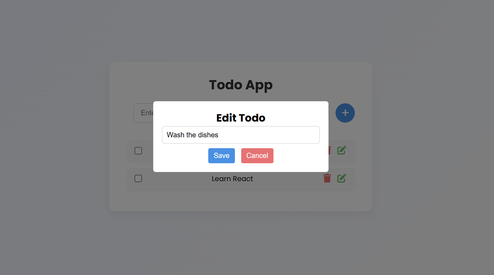

📝 Todo List App
A simple and responsive todo list application that allows users to manage their tasks. Tasks can be added, edited, marked as completed, and deleted. All tasks are stored in the browser's localStorage to persist data even after page reloads.

🚀 Features
Add tasks to your todo list

Edit tasks using a popup dialog

Mark tasks as completed by checking a checkbox

Delete tasks from the list

Persistent data stored in localStorage to survive page reloads

Responsive design for use on mobile and desktop

📸 Screenshot

🛠️ Technologies Used
HTML5

CSS3

JavaScript (ES6)

Font Awesome (for icons)

localStorage (for data persistence)

## 📦 Installation

1. **Clone the repository:**

```bash
git clone https://github.com/IulianFrunza98/todo-app.git
cd weather-app
```

## 📸 Screenshot




✨ How to Use

1. Add a Todo
   Enter a task in the input field and click the Add button or press Enter to add it to your todo list.

2. Edit a Todo
   Click the Edit button on any task to open a popup and modify the task text.

Once edited, click Save to update the task.

3. Mark a Todo as Completed
   Click the checkbox next to any task to mark it as completed.

The task will be visually struck through and saved as completed.

4. Delete a Todo
   Click the Delete button next to any task to remove it from your list.

🔧 How It Works
Data Persistence: Tasks are stored in localStorage, ensuring that the todo list persists even after page reloads.

Dynamic UI: The application dynamically updates the list as tasks are added, edited, or deleted.

Responsive: The app is designed to be responsive and works on both desktop and mobile devices.

💡 Future Improvements
Add the ability to filter tasks by status (e.g., show only completed tasks).

Add due dates or priority levels for tasks.

Integrate a backend to store tasks online (e.g., using Firebase).

🤝 Contributing
Feel free to fork the repository, create branches, and submit pull requests. Contributions are welcome to enhance the app!
